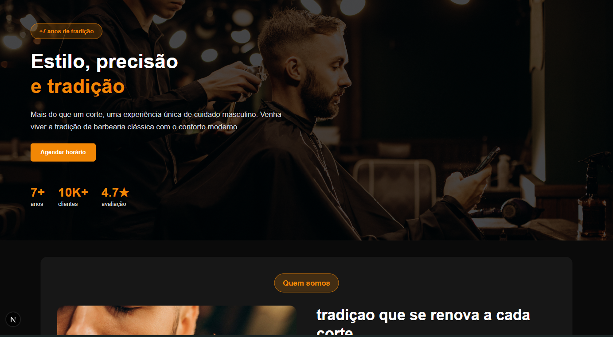
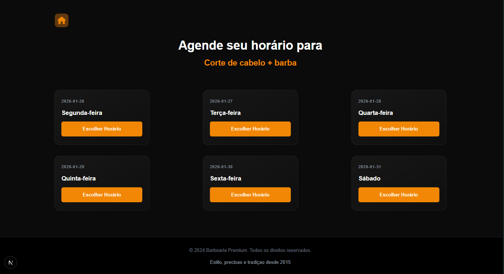

<h1 align="center" style="font-weight: bold;">Nome do Projeto 💻</h1>

<p align="center">
 - <a href="#layout">Layout</a> 
 - <a href="#sobre">Sobre</a> 
 - <a href="#tecnologias-utilizadas">Tec Utilizadas</a>
 - <a href="#como-usar">Instruções de uso </a>  
 - <a href="#funcionalidades">Funcionalidades</a>  
 - <a href="#estrutura do projeto">estrutura do projeto</a>  
 - <a href="#status">Status</a> 
</p>

<p align="center">
    Sistema de agendamento online para barbearias, permitindo que clientes escolham horários disponíveis e enviem solicitações diretamente para o WhatsApp do barbeiro.
</p>

<p align="center">
     <a href="URL_DO_PROJETO">📱 Ver Projeto</a>
</p>

---

<h2 id="layout">🎨 Layout</h2>

<p align="center">
    
    
</p>

---

<h2 id="sobre">💡 Sobre</h2>
<h4> oque ele resolve </h4>
<p>
Este projeto foi desenvolvido em parceria com um desenvolvedor sênior, que forneceu o layout e direcionamento técnico, enquanto a implementação foi realizada por mim como forma de consolidar conhecimentos em React e boas práticas de desenvolvimento.

A proposta do sistema é resolver um problema comum em barbearias locais: a organização manual de agendamentos, muitas vezes feita diretamente pelo WhatsApp, o que pode gerar conflitos de horário e perda de tempo.

Com essa aplicação, o cliente pode acessar o site, visualizar os horários disponíveis e ocupados em tempo real, escolher o melhor horário e enviar automaticamente uma solicitação via WhatsApp para o barbeiro. A confirmação final ainda fica sob responsabilidade do profissional, garantindo controle total da agenda.

Além de ser um projeto prático para aprendizado, ele também foi pensado como um produto real, com potencial de ser comercializado para barbearias da região.
</p>

---

<h2 id="funcionalidades">⚡ Funcionalidades</h2>

- **Visualização de horários disponíveis e ocupados**
- **Seleção de serviços oferecidos pela barbearia**
- **Escolha de data e horário para agendamento**
- **Validação de disponibilidade antes do envio**
- **Envio automático de mensagem para o WhatsApp do barbeiro**
- **Interface responsiva e adaptada para diferentes dispositivos**

---

<h2 id="tecnologias-utilizadas">💻 Tecnologias Utilizadas</h2>

- **React + TypeScript**
- **Tailwind CSS**
- **Axios (requisições HTTP)**
- **JSON Server (simulação de API)**
- **TanStack Query (gerenciamento de dados e cache)**

---

<h2 id="estrutura do projeto">⚡ Estrutura do projeto </h2>

```

app/
  ├─ components/
  │   ├─ Header, Footer, Button, CardStandard
  │   │   # Componentes reutilizáveis da interface
  │   │
  │   ├─ WhoWeAre
  │   │   # Seção da home com informações básicas sobre a barbearia
  │   │
  │   ├─ Services
  │   │   # Seção da home para escolha do serviço (inicia o fluxo de agendamento)
  │   │
  │   ├─ Reviews
  │   │   # Seção da home que exibe avaliações dos clientes
  │   │
  │   ├─ ContactLocation
  │   │   # Seção da home com dados de contato e localização da barbearia
  │   │
  │   ├─ ModalChoseTime
  │   │   # Modal de seleção de horários disponíveis para o dia escolhido.
  │   │   # Salva o horário no contexto global e navega para confirmação.
  │   │
  │   └─ ModalFinish
  │       # Modal final que exibe resumo do agendamento, envia dados para API,
  │       # dispara confirmação via WhatsApp, limpa o estado e retorna à home.
  │
  ├─ contexts/
  │   └─ AppointmentCtx
  │       # Contexto global que gerencia o estado do agendamento (dia, horário,
  │       # serviço e dados do cliente) usando useReducer. Disponibiliza funções
  │       # para atualizar ou limpar informações de forma centralizada.
  │
  ├─ pages/
  │   ├─ Home
  │   │   # Página inicial que renderiza as principais seções do site.
  │   │   # Processa dados dos mocks (idade do barbeiro, média de avaliações)
  │   │   # e distribui para os componentes filhos.
  │   │
  │   ├─ SelectAppointmentDate
  │   │   # Exibe dias disponíveis para agendamento. Ao selecionar um dia,
  │   │   # abre modal com horários e salva escolha no contexto global.
  │   │
  │   └─ ConfirmAppointment
  │       # Coleta e valida dados do cliente (nome e telefone).
  │       # Exibe modal de confirmação final e permite resetar o agendamento.
  │
  ├─ mocks/
  │   └─ mock
  │       # Dados estáticos relacionados à barbearia
  │
  ├─ types/
  │   └─ # Definições de tipos TypeScript utilizados no projeto
  │
  └─ reducer/
      └─ reducer
          # Gerencia atualizações do estado de agendamento de forma imutável.
          # Processa ações (atualizar serviço, dia, horário, cliente) e
          # permite resetar todos os dados quando necessário.

public/
  └─ imgs/
      # Imagens utilizadas na aplicação

server.json
  # Base de dados simulada (JSON Server) contendo dias e horários disponíveis.
  # Armazena informações de agendamentos (cliente, serviço, valor, contato)
  # e identifica horários livres ou reservados.    
```


---

<h2 id="como-usar">📚 Intruções iniciais de Uso</h2>


<h3 id="instalação">⚙️ Instalação </h3>

```bash
# 1. Clone o repositório
git clone https://github.com/seu-usuario/nome-do-projeto.git

# 2. Entre na pasta do projeto
cd nome-do-projeto

# 3. Instale todas as dependências
npm install

# 4. Inicie o servidor fake (JSON Server)
npm run server

# 5. Inicie a aplicação
npm run dev
```

<br>

<h3 id="instalação">⚙️ Como usar:</h3>

<h4>1. Passo 1</h4>
Acesse a página inicial e escolha o serviço desejado.

<h4>2. Passo 2</h4>
Selecione uma data disponível para visualizar os horários.

<h4>3. Passo 3</h4>
Escolha um horário livre (os horários já ocupados estarão indisponíveis).

<h4>4. Passo 4</h4>
Preencha seus dados (nome e telefone) para continuar.

<h4>5. Passo 5</h4>
Confirme o agendamento e envie a solicitação para o WhatsApp do barbeiro.

---


<h2 id="status">🚀 Status do Projeto</h2>


---

<h2>🤝 Autor</h2>

<table>
  <tr>
    <td align="center">
      <a href="https://github.com/mateus073">
        <br>
        <sub><b>Seu Nome</b></sub>
      </a>
    </td>
  </tr>
</table>